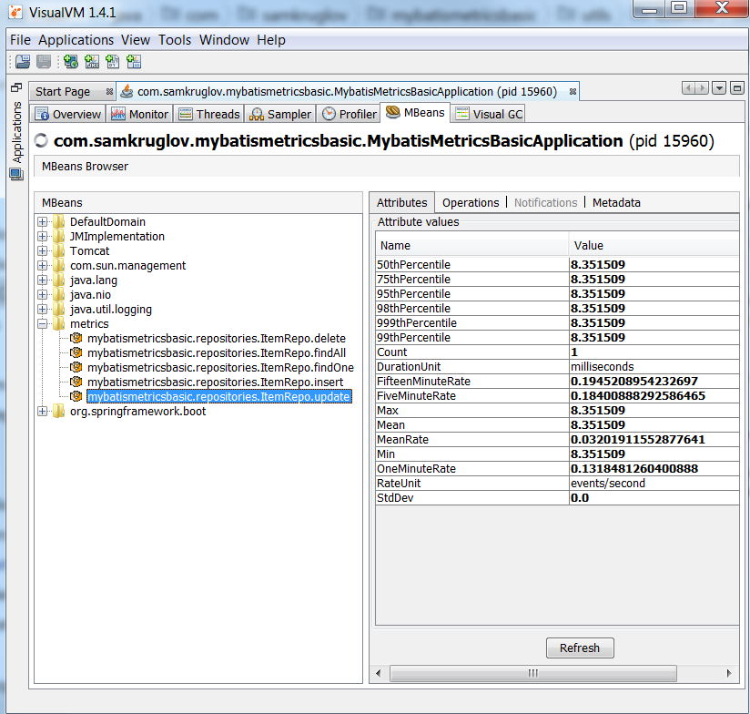

# MyBatis Metrics Basic

Measuring data access layer (MyBatis) performance with DropWizard metrics 
( the main use case is just the amount of time it takes to complete each query).

Here is what it looks like in MBeans plugin of VisualVM:

---
Inspired by [tguzik's project](https://github.com/tguzik/mybatis-metrics)
